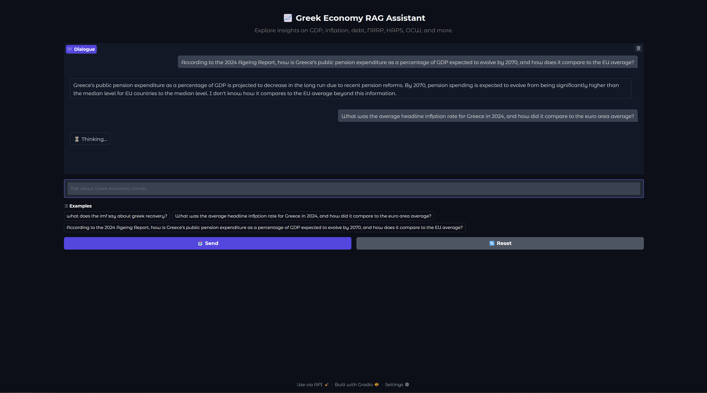

# Greek Economy RAG Assistant

A Retrieval-Augmented Generation (RAG) virtual assistant built with LangChain and FastAPI to answer questions about the Greek economy using authoritative sources like Bank of Greece, Eurostat, and IMF documents.





## Features

- Multi-query vector search using LangChain
- Re-ranking of documents via LLM grading
- Fallback to web search (Tavily) when no internal documents match
- FastAPI backend with optional Gradio UI
- LangSmith integration for evaluation and tracing

---

##  Setup Instructions

### 1. Clone the Repository

```bash
git clone https://github.com/PantosThn/rag-virtual-assistant-course.git
cd rag-virtual-assistant-course
```

### 2. Install Python 3.12

> Ensure Python 3.12 is installed. If not, use one of the methods below:

- **macOS**
  ```bash
  brew install python@3.12
  ```
- **Ubuntu**
  ```bash
  sudo apt update
  sudo apt install python3.12 python3.12-venv python3.12-dev
  ```
- **Windows**  
  Download from [python.org](https://www.python.org/downloads/release/python-3100/)

---

##  3. Install Poetry

### On macOS & Linux

```bash
curl -sSL https://install.python-poetry.org | python3 -
```

### On Windows

#### ➤ If using **PowerShell**:

```powershell
(Invoke-WebRequest -Uri https://install.python-poetry.org -UseBasicParsing).Content | python -
```

#### ➤ If using **Git Bash**:

```bash
curl -sSL https://install.python-poetry.org | python3 -
```

Then add this line to your `~/.bashrc` (or `~/.bash_profile`):

```bash
export PATH="$HOME/.local/bin:$PATH"
```

And reload your shell:

```bash
source ~/.bashrc
```

> Verify installation with: `poetry --version`

> 🔗 Official installer page: [https://python-poetry.org/docs/#installation](https://python-poetry.org/docs/#installation)

---

### 4. Install Dependencies

```bash
poetry install
```

---

### 5.  Environment Configuration

Before running the project, create a `.env` file in the project root directory with the following contents:

<details>
<summary>Click to expand .env example</summary>

```env
# Option 1: Recommended (Groq)
GROQ_API_KEY=your-groq-api-key

# Option 2: OpenAI (if you have one)
OPENAI_API_KEY=your-openai-api-key

# Optional LangChain settings for LangSmith
LANGCHAIN_API_KEY=your-langsmith-api-key
LANGCHAIN_TRACING_V2=true
LANGCHAIN_ENDPOINT=https://api.smith.langchain.com
USER_AGENT=Mozilla/5.0 (compatible; RAG-TutorialBot/1.0; +https://yourwebsite.com/bot)

# Optional Web Search
TAVILY_API_KEY=your-tavily-api-key
```

</details>

### 6. Usage

#### Activate Environment

```bash
poetry shell
```

#### Run the Backend (FastAPI)

```bash
uvicorn backend.main:app --reload
```

#### Access Gradio UI (optional)

Visit ```bash[http://localhost:8000/ui](http://localhost:8000/ui)``` in your browser.

---

## Powered By

- LangChain
- OpenAI / Groq
- ChromaDB
- Tavily (for web search fallback)
- Gradio + FastAPI
- LangSmith

---
